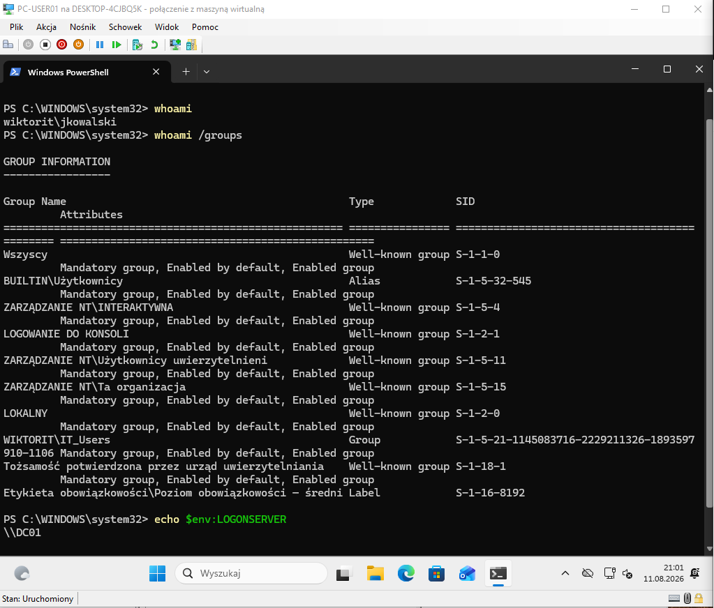
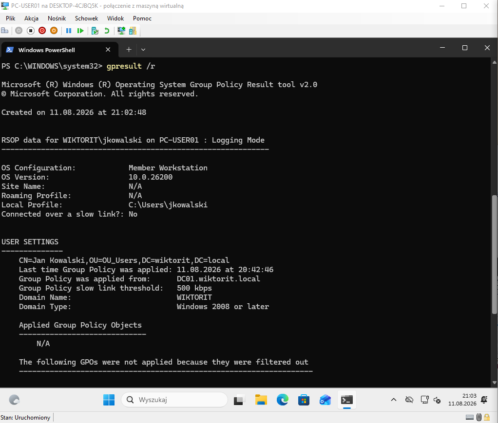
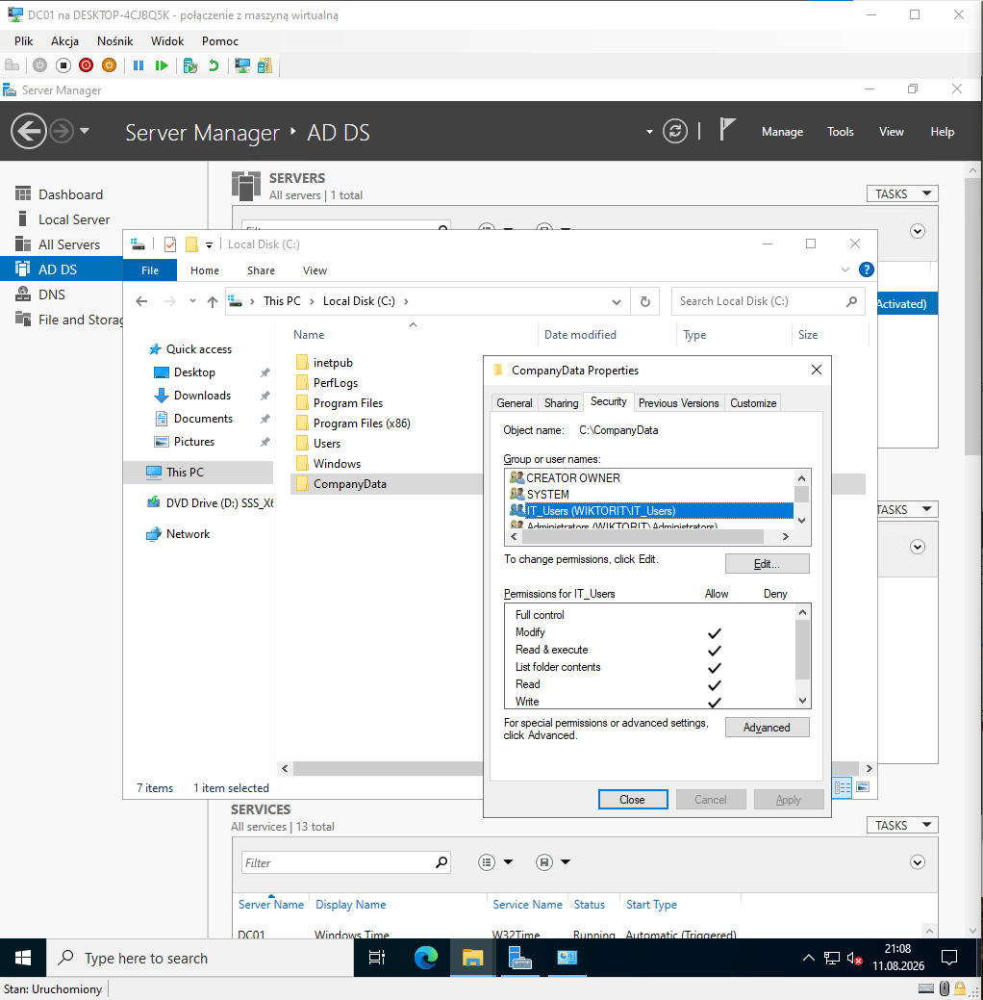
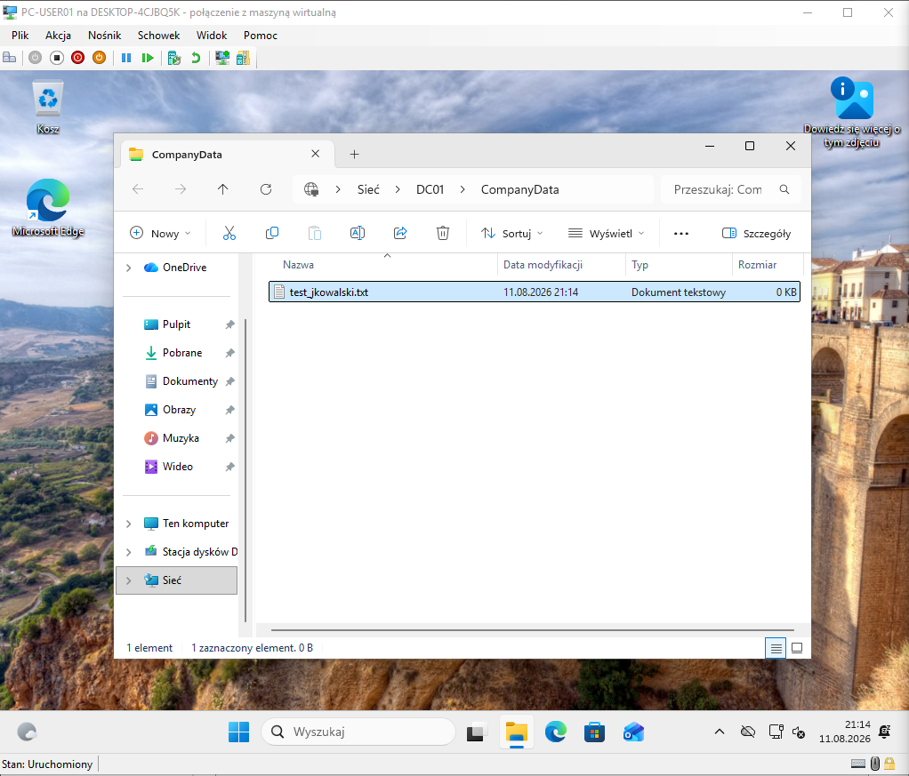

# home-lab-windows-server
EN: IT Helpdesk Home Lab – Windows Server, Active Directory, GPO || PL: Laboratorium IT Helpdesk – Windows Server, Active Directory, GPO
# IT Helpdesk & Windows Administration Lab

>  English | Polski

A hands-on home lab focused on building practical skills for **IT Helpdesk / IT Support / Junior IT Administration** roles.

The project documents my learning process through real configuration tasks, Active Directory administration and Windows client/server management.

---

English

**Project Goal**

The goal of this project is to build practical, hands-on IT support and system administration skills in a controlled laboratory environment.

Instead of only learning theory, I use virtual machines to simulate a small company environment and practice tasks commonly encountered by Helpdesk and Junior IT Support teams.

---

**Current Lab Environment**

| Component          | Configuration                    |
| ------------------ | -------------------------------- |
| Domain Controller  | Windows Server 2016              |
| Client             | Windows 11                       |
| Hypervisor         | Microsoft Hyper-V                |
| Domain             | `wiktorit.local`                 |
| Domain Controller  | `DC01`                           |
| DC IP Address      | `172.18.244.10`                  |
| Client             | `PC-USER01`                      |
| Directory Services | Active Directory Domain Services |
| DNS                | Windows Server DNS               |

---

Completed

Windows Server & Active Directory

* Installed and configured Windows Server 2016
* Configured a static IPv4 address for the Domain Controller
* Installed **Active Directory Domain Services**
* Created the `wiktorit.local` domain
* Configured Windows Server DNS
* Created Organizational Units
* Created domain users
* Created security groups
* Configured user membership in security groups

Group Policy

* Created and configured Group Policy
* Configured domain password requirements
* Tested password policy enforcement
* Verified GPO application on the Windows 11 client using `gpresult`

Windows 11 Domain Client

* Installed Windows 11 virtual machine
* Configured network connectivity
* Configured the client to use the Domain Controller as its DNS server
* Verified domain name resolution using `nslookup`
* Joined Windows 11 to the Active Directory domain
* Logged in using a domain user account
* Verified domain authentication using PowerShell

File Shares & Permissions

* Created a company network resource
* Configured NTFS permissions
* Configured SMB network sharing
* Used Active Directory security groups to control access
* Tested user access to the network share
* Verified that permissions work from the end-user perspective

Example:

\\DC01\CompanyData

Access is granted through the appropriate Active Directory security group rather than directly assigning permissions to individual users.

---

**PowerShell**

PowerShell is being developed as part of the lab with a focus on practical IT support and administration tasks.

Planned exercises include:

* User management
* Group management
* System information
* Network diagnostics
* Service management
* Event log investigation
* Bulk user creation
* Automation of repetitive Helpdesk tasks

---

**Planned / In Progress**

The lab is continuously evolving.

Planned topics include:

* [ ] PowerShell automation
* [ ] Bulk user creation from CSV
* [ ] More Active Directory administration scenarios
* [ ] Advanced Group Policy configuration
* [ ] Microsoft 365 administration basics
* [ ] Outlook troubleshooting
* [ ] Exchange fundamentals
* [ ] Microsoft Entra ID / Azure fundamentals
* [ ] Intune fundamentals
* [ ] Additional Windows troubleshooting scenarios
* [ ] More realistic Helpdesk ticket simulations
* [ ] Documentation of troubleshooting procedures

---

**Lab Documentation**

The repository contains screenshots documenting the configuration and verification of the laboratory environment.

**Active Directory & Domain Authentication**

Windows Server 2016 was configured as a Domain Controller with Active Directory Domain Services, DNS and the `wiktorit.local` domain.

**Group Policy**

Domain Group Policy was configured and verified on the Windows 11 client.

**NTFS Permissions**

NTFS permissions were configured for the `IT_Users` security group, granting Modify access to the company resource.

**Network Share**

The Windows 11 domain user successfully accessed the `CompanyData` network share using Active Directory group-based permissions.

**Additional Lab Screenshots**

Additional screenshots documenting the configuration process are available in the [`screenshots`](screenshots/) directory.

The screenshots are provided as evidence of hands-on work performed in the laboratory environment.

---

**What I Am Learning**

This project is helping me develop practical knowledge in:

**Windows**

* Windows 11
* Windows Server
* System administration
* Troubleshooting

**Networking**

* IPv4
* DNS
* DHCP
* TCP/IP
* Default Gateway
* Basic network diagnostics

**Active Directory**

* Users
* Groups
* OUs
* Group Policy
* Authentication
* Permissions
* Domain administration

**IT Support**

* Incident troubleshooting
* Root-cause analysis
* User support
* Documentation
* Problem verification

**Automation**

* PowerShell
* Administrative scripting

---

**Project Status**

**Active — continuously developing**

This repository documents my progression from IT fundamentals toward practical **IT Helpdesk / IT Support / Junior System Administration** skills.

---

# 🇵🇱 Polski

**Cel projektu**

Celem projektu jest zdobycie praktycznych umiejętności potrzebnych do pracy na stanowiskach:

* IT Helpdesk
* IT Support
* Service Desk
* Junior IT Administrator

Zamiast ograniczać się do teorii, tworzę własne środowisko laboratoryjne i wykonuję zadania odwzorowujące rzeczywiste środowisko firmowe.

Projekt dokumentuje zarówno konfigurację infrastruktury, jak i rozwiązywanie problemów użytkowników.

---

**Obecne środowisko laboratoryjne**

| Element           | Konfiguracja                     |
| ----------------- | -------------------------------- |
| Kontroler domeny  | Windows Server 2016              |
| Klient            | Windows 11                       |
| Hypervisor        | Microsoft Hyper-V                |
| Domena            | `wiktorit.local`                 |
| Kontroler domeny  | `DC01`                           |
| Adres IP DC       | `172.18.244.10`                  |
| Stacja kliencka   | `PC-USER01`                      |
| Usługi katalogowe | Active Directory Domain Services |
| DNS               | Windows Server DNS               |

---

**Zrealizowane**

**Windows Server i Active Directory**

* Instalacja i konfiguracja Windows Server 2016
* Konfiguracja statycznego adresu IPv4 dla Domain Controllera
* Instalacja **Active Directory Domain Services**
* Utworzenie domeny `wiktorit.local`
* Konfiguracja DNS
* Utworzenie jednostek organizacyjnych (OU)
* Tworzenie użytkowników domenowych
* Tworzenie grup zabezpieczeń
* Zarządzanie członkostwem użytkowników w grupach

**Group Policy**

* Utworzenie i konfiguracja Group Policy
* Konfiguracja wymagań dotyczących haseł
* Praktyczne sprawdzenie działania polityki haseł
* Weryfikacja zastosowania GPO na komputerze klienckim przy użyciu `gpresult`

**Windows 11 jako klient domenowy**

* Instalacja Windows 11 jako maszyny wirtualnej
* Konfiguracja połączenia sieciowego
* Konfiguracja DNS wskazującego na Domain Controllera
* Weryfikacja rozwiązywania nazw przy użyciu `nslookup`
* Dołączenie Windows 11 do domeny Active Directory
* Logowanie przy użyciu konta domenowego
* Weryfikacja uwierzytelnienia domenowego przy użyciu PowerShell

**Udostępnianie plików i uprawnienia**

* Utworzenie firmowego zasobu sieciowego
* Konfiguracja uprawnień NTFS
* Konfiguracja udziału sieciowego SMB
* Wykorzystanie grup zabezpieczeń Active Directory do zarządzania dostępem
* Testowanie dostępu do zasobu z perspektywy użytkownika
* Weryfikacja poprawności konfiguracji uprawnień

Przykładowy zasób:

\\DC01\CompanyData

Dostęp jest kontrolowany poprzez grupę zabezpieczeń Active Directory zamiast nadawania uprawnień każdemu użytkownikowi indywidualnie.

---

**PowerShell**

PowerShell jest rozwijany jako jeden z elementów projektu, ze szczególnym naciskiem na praktyczne zastosowanie w IT Support i administracji.

Planowane ćwiczenia:

* zarządzanie użytkownikami
* zarządzanie grupami
* informacje o systemie
* diagnostyka sieci
* zarządzanie usługami
* analiza logów systemowych
* masowe tworzenie użytkowników
* automatyzacja powtarzalnych zadań Helpdesk

---

**W trakcie / planowane**

Projekt jest stale rozwijany.

Planowane elementy:

* [ ] Automatyzacja w PowerShell
* [ ] Masowe tworzenie użytkowników z pliku CSV
* [ ] Kolejne scenariusze administracji Active Directory
* [ ] Zaawansowane konfiguracje Group Policy
* [ ] Podstawy administracji Microsoft 365
* [ ] Troubleshooting Outlook
* [ ] Podstawy Exchange
* [ ] Microsoft Entra ID / Azure
* [ ] Podstawy Intune
* [ ] Kolejne scenariusze troubleshootingowe Windows
* [ ] Więcej symulowanych ticketów Helpdesk
* [ ] Dokumentowanie procedur diagnostycznych

---

**Dokumentacja projektu**

Repozytorium zawiera screenshoty dokumentujące proces konfiguracji i testowania środowiska laboratoryjnego.

**Active Directory i uwierzytelnianie domenowe**

Windows Server 2016 został skonfigurowany jako Domain Controller z usługami Active Directory Domain Services, DNS oraz domeną `wiktorit.local`.

**Group Policy**

Skonfigurowano politykę domenową oraz zweryfikowano jej zastosowanie na komputerze klienckim Windows 11.

**Uprawnienia NTFS**

Skonfigurowano uprawnienia NTFS dla grupy zabezpieczeń `IT_Users`, przyznając jej dostęp typu Modify do zasobu firmowego.

**Udział sieciowy**

Użytkownik domenowy Windows 11 uzyskał dostęp do udziału `CompanyData` przy wykorzystaniu uprawnień opartych na członkostwie w grupie Active Directory.

**Pozostałe screenshoty**

Pozostałe screenshoty dokumentujące proces konfiguracji środowiska znajdują się w katalogu [`screenshots`](screenshots/).

Screenshoty stanowią potwierdzenie praktycznej pracy wykonanej w środowisku laboratoryjnym.

---

**Czego się uczę**

Projekt rozwija praktyczną wiedzę w zakresie:

**Windows**

* Windows 11
* Windows Server
* administracja systemem
* troubleshooting

**Sieci**

* IPv4
* DNS
* DHCP
* TCP/IP
* Default Gateway
* podstawowa diagnostyka sieci

**Active Directory**

* użytkownicy
* grupy
* OU
* Group Policy
* uwierzytelnianie
* uprawnienia
* administracja domeną

**IT Support**

* obsługa incydentów
* diagnostyka problemów
* analiza przyczyn
* wsparcie użytkowników
* dokumentacja
* weryfikacja rozwiązania

**Automatyzacja**

* PowerShell
* skrypty administracyjne

---

**Status projektu**

**Aktywny — projekt jest stale rozwijany.**

Repozytorium dokumentuje moją drogę od podstaw IT do praktycznych umiejętności związanych z **IT Helpdesk, IT Support oraz Junior System Administration**.
